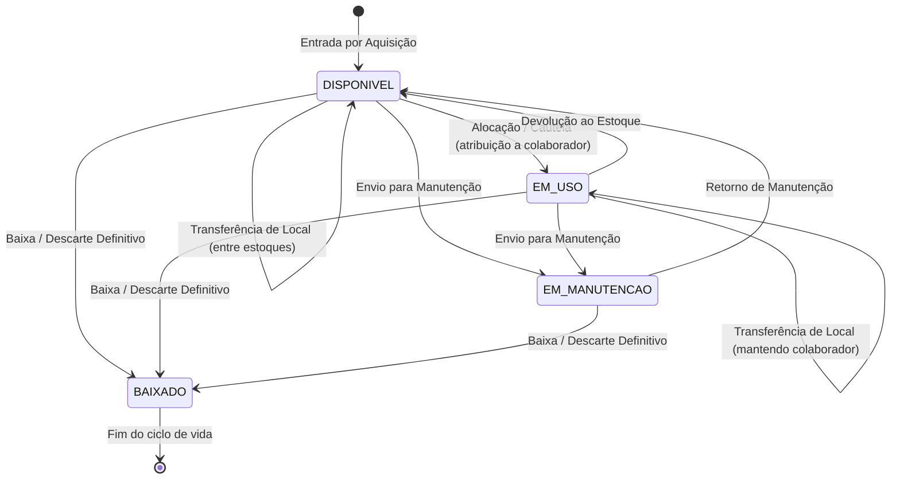

# Data Model: Correção das Regras de Movimentação Patrimonial

**Feature**: 005-correcao-regras-movimentacao | **Date**: 2026-09-15
**Natureza**: Sem alterações estruturais de DDL, sem novas tabelas ou colunas. Este documento formaliza as regras de integridade, combinações de estado e mapeamento de campos aplicados na criação de movimentações no SisPatrimônio Pro.

---

## 1. Entidades Envolvidas e Atributos Relevantes

### 1.1 `Asset` (`assets`)
Entidade principal do equipamento patrimonial.
- `id` (int, PK): Identificador único do bem.
- `status` (`AssetStatus`): Estado operacional do bem (`DISPONIVEL`, `EM_USO`, `EM_MANUTENCAO`, `EM_TRANSITO`, `BAIXADO`).
- `condition` (`AssetCondition`): Condição física (`NOVO`, `EXCELENTE`, `BOM`, `REGULAR`, `RUIM`, `INSERVIVEL`).
- `location_id` (int, FK `locations.id`, nullable): Localidade física atual do bem.
- `custodian_id` (int, FK `custodians.id`, nullable): Colaborador responsável atual. Quando `None`, o bem está no estoque/sem responsável.
- `updated_at` (datetime, UTC): Timestamp de última atualização do bem.

### 1.2 `Movement` (`movements`)
Registro imutável que documenta o histórico do ciclo de vida patrimonial.
- `id` (int, PK): Identificador da movimentação.
- `movement_uuid` (str, UUID): Identificador universal único do registro.
- `asset_id` (int, FK `assets.id`): Bem movimentado.
- `movement_type` (`MovementType`): Tipo da movimentação (`ENTRADA_AQUISICAO`, `ALOCACAO_CAUTELA`, `TRANSFERENCIA_LOCAL`, `ENVIO_MANUTENCAO`, `RETORNO_MANUTENCAO`, `DEVOLUCAO_ESTOQUE`, `BAIXA_DESCARTE`, `ATUALIZACAO_ESTADO`).
- `timestamp` (datetime, UTC): Instante em que a movimentação foi efetivada.
- `origin_location_id` / `origin_location_name`: Snapshot do local de origem.
- `origin_custodian_id` / `origin_custodian_name`: Snapshot do custodiante de origem.
- `destination_location_id` / `destination_location_name`: Snapshot do local de destino.
- `destination_custodian_id` / `destination_custodian_name`: Snapshot do custodiante de destino.
- `previous_status` / `new_status`: Transição de status do ativo.
- `previous_condition` / `new_condition`: Condição física anterior e nova.
- `reason` (str): Justificativa obrigatória da operação.
- `operator_name` (str): Operador que registrou a movimentação.
- `term_code` (str, nullable): Código único do Termo de Responsabilidade/Cautela (`TR-YYYY-NNNNN`).
- `term_signed` (bool): Indicador de assinatura do termo.

---

## 2. Matriz de Combinação Origem x Destino (Local x Responsável)

A avaliação da operação considera quatro valores:
1. `origin_location_id = asset.location_id`
2. `origin_custodian_id = asset.custodian_id`
3. `dest_location_id = data.destination_location_id or origin_location_id`
4. `dest_custodian_id` (dependente do tipo de operação)

| Origem Local | Origem Custodiante | Destino Local | Destino Custodiante | Tipo Selecionado | Resultado e Ação do Sistema |
|---|---|---|---|---|---|
| Igual | Igual | Igual | Igual | Qualquer | ❌ **BLOQUEAR**: Nenhuma alteração efetiva detectada. Nenhuma gravação permitida. |
| Igual | Qualquer | Igual | Diferente | `TRANSFERENCIA_LOCAL` | ❌ **BLOQUEAR**: Local não foi alterado. Transferência exige mudança de setor/filial. Recomenda `ALOCACAO_CAUTELA`. |
| Igual | Qualquer | Igual | Diferente | `ALOCACAO_CAUTELA` | ✅ **PERMITIR**: Alocação/Cautela a novo colaborador no mesmo local. Gera termo `TR-...`, status `EM_USO`. |
| Diferente | Qualquer | Diferente | Igual | `ALOCACAO_CAUTELA` | ❌ **BLOQUEAR**: Responsável não foi alterado. Recomenda `TRANSFERENCIA_LOCAL`. |
| Diferente | Qualquer | Diferente | Igual | `TRANSFERENCIA_LOCAL` | ✅ **PERMITIR**: Mudança oficial de localidade mantendo o responsável (ou ambos em estoque). Atualiza local, preserva custodiante no bem e no registro. |
| Diferente | Qualquer | Diferente | Diferente (novo) | `TRANSFERENCIA_LOCAL` | ❌ **BLOQUEAR**: Entrega a novo colaborador deve ser registrada como Alocação / Cautela para emissão do Termo de Responsabilidade. |
| Diferente | Qualquer | Diferente | Diferente (novo) | `ALOCACAO_CAUTELA` | ✅ **PERMITIR**: Alocação com entrega em nova localidade. Atualiza local e colaborador atomicamente, status `EM_USO`, gera `TR-...`. |
| Qualquer | Estoque (`None`) | Qualquer | Colaborador | `ALOCACAO_CAUTELA` | ✅ **PERMITIR**: Saída do estoque para colaborador. Status passa a `EM_USO`, gera `TR-...`. |
| Qualquer | Estoque (`None`) | Qualquer | Nenhum (`None`) | `ALOCACAO_CAUTELA` | ❌ **BLOQUEAR**: Alocação / Cautela exige colaborador de destino. |
| Igual | Estoque (`None`) | Igual | Nenhum (`None`) | `DEVOLUCAO_ESTOQUE` | ❌ **BLOQUEAR**: Bem já se encontra no estoque neste local. |
| Qualquer | Colaborador | Qualquer | Estoque (`None`) | `DEVOLUCAO_ESTOQUE` | ✅ **PERMITIR**: Devolução ao estoque. Remove colaborador (`custodian_id=None`), status passa a `DISPONIVEL`, gera termo de devolução. |
| Qualquer | Qualquer | N/A | N/A | `BAIXA_DESCARTE` | ✅ **PERMITIR**: Baixa definitiva. Status passa a `BAIXADO`, remove colaborador. Bloqueia se já estiver baixado. |

---

## 3. Transições de Status do Ativo (`AssetStatus`)

---

## 4. Mapeamento de Campos e Correções de Integridade

### 4.1 Correção do Vínculo de Custodiante em `TRANSFERENCIA_LOCAL`
Na implementação anterior, quando uma transferência era executada sem especificar novo custodiante no payload, o bem mantinha o colaborador anterior, mas a tabela `movements` gravava `destination_custodian_id = None`.
- **Regra corrigida**:
  - `effective_dest_custodian_id = data.destination_custodian_id or prev_custodian_id`
  - A movimentação salva `destination_custodian_id = effective_dest_custodian_id` e `destination_custodian_name = new_custodian_name or prev_custodian_name`.
  - Desta forma, a trilha histórica reflete com fidelidade que o bem continua com o colaborador no novo local.

### 4.2 Geração de Termo de Responsabilidade
- Obrigatória para `MovementType.ALLOCATION` e `MovementType.RETURN_STOCK`.
- Formato: `TR-YYYY-NNNNN` (sequencial anual imutável).
- Não gerada para `TRANSFERENCIA_LOCAL` pura, `ENVIO_MANUTENCAO` ou `RETORNO_MANUTENCAO`.
