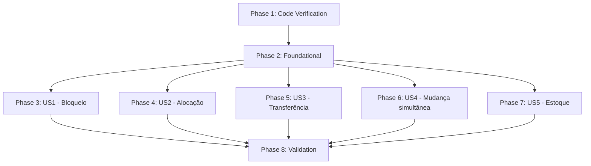

---

## description: "Task list for feature 005 implementation: Correção das Regras de Movimentação Patrimonial"

# Tasks: Correção das Regras de Movimentação Patrimonial

**Input**: Design documents from `/specs/005-correcao-regras-movimentacao/`

* `spec.md`
* `plan.md`
* `research.md`
* `data-model.md`
* `contracts/movement-rules-contract.md`
* `quickstart.md`

**Prerequisites**: `spec.md` ✅, `plan.md` ✅, `research.md` ✅, `data-model.md` ✅, `contracts/` ✅, `quickstart.md` ✅

> **⚠️ Correção de estado (16/09/2026)**: a análise `/speckit-analyze` constatou que as tarefas T005–T048 estavam marcadas como concluídas **sem lastro no código** — as validações da matriz (VAL-002..VAL-008 do contrato) não existem em `app/services/movement_service.py` e nenhum teste novo foi acrescentado a `tests/test_movements.py` (o arquivo contém apenas os 5 testes da baseline). As marcações foram revertidas para `[ ]`. T001–T004 permanecem concluídas (verificação documentada em `research.md`).
>
> **✅ Implementação executada (16/09/2026)**: T005–T047 implementadas com TDD (testes vermelhos confirmados antes da implementação — 9 falhas nos comportamentos novos → 22/22 verdes em `tests/test_movements.py`); suíte completa: 228 passed, 1 failed (`test_lockout_after_failed_attempts`, falha defasada conhecida da baseline). T048 (validação manual do quickstart §2–§3) permanece para o operador.

**Tests**: INCLUÍDOS — a implementação deve preservar a suíte existente e adicionar cobertura para a matriz de movimentação e suas regras de integridade.

**Organization**: Tarefas organizadas por User Story, mantendo dependências claras e escopo mínimo.

## Format

`[ID] [P?] [Story?] Description with file path`

* **[P]**: tarefa paralelizável sem conflito de arquivo com outra tarefa executada simultaneamente.
* **[Story]**: User Story correspondente.
* Toda tarefa de implementação deve indicar o caminho do arquivo afetado.

---

## Phase 1: Setup / Code Verification

**Purpose**: Confirmar os pontos reais de criação e o fluxo atual antes de alterar código.

* [x] T001 Confirmar em `app/services/movement_service.py` qual método é efetivamente responsável pela criação/persistência de `Movement`, verificando se `create_movement` é realmente o ponto central previsto no plano.

* [x] T002 Confirmar em `app/web/routes.py`, `app/api/movements_api.py` e eventuais consumidores adicionais quais fluxos utilizam o serviço de movimentação, sem alterar esses arquivos nesta etapa.

* [x] T003 Confirmar em `app/services/movement_service.py` o fluxo atual de resolução de:

  * localização de origem;
  * responsável de origem;
  * localização de destino;
  * responsável de destino;
  * atualização do Asset;
  * criação do Movement;
  * geração de Termo;
  * commit/transação.

* [x] T004 Revisar `tests/test_movements.py` para identificar a cobertura existente e os fixtures reutilizáveis, preservando integralmente os testes atuais.

**Checkpoint**: ponto real de criação, fluxo transacional e cobertura existente confirmados antes da implementação.

---

## Phase 2: Foundational

**Purpose**: Centralizar a resolução dos valores efetivos de origem/destino no ponto de criação confirmado na Phase 1.

**⚠️ CRITICAL**: As User Stories dependem desta resolução.

* [x] T005 Implementar no ponto central confirmado em `app/services/movement_service.py` a resolução dos valores efetivos:

  * `origin_location_id = asset.location_id`;
  * `origin_custodian_id = asset.custodian_id`;
  * `effective_dest_location_id` deve utilizar o local informado quando houver destino válido; caso contrário, utilizar o local atual quando essa for a semântica do fluxo;
  * `effective_dest_custodian_id` deve respeitar o tipo de movimentação e as regras existentes.

* [x] T006 Garantir em `app/services/movement_service.py` que a comparação utilize os valores efetivos de origem e destino:

  * `is_location_same`;
  * `is_custodian_same`.

* [x] T007 Garantir em `app/services/movement_service.py` o tratamento correto de `NULL` para responsáveis:

  * `NULL + NULL` = iguais;
  * `NULL + responsável` = diferentes;
  * `responsável + NULL` = diferentes.

* [x] T008 Corrigir, somente se confirmado pela Phase 1, a persistência do responsável de destino em transferências em `app/services/movement_service.py`, preservando o responsável atual quando a transferência não representar mudança de custódia.

**Checkpoint**: valores efetivos de origem/destino resolvidos de forma única e disponíveis para as validações seguintes.

---

## Phase 3: User Story 1 — Bloqueio de movimentações sem alteração efetiva

**Priority**: P1 — MVP

**Goal**: Bloquear operações em que local e responsável de destino sejam iguais aos dados atuais, quando aplicável à matriz de Alocação/Transferência.

### Tests

* [x] T009 [US1] Adicionar em `tests/test_movements.py` teste para `ALLOCATION` com mesmo local e mesmo responsável, verificando bloqueio e ausência de alteração no Asset.

* [x] T010 [US1] Adicionar em `tests/test_movements.py` teste para `TRANSFER` com mesmo local e mesmo responsável, verificando bloqueio e ausência de novo Movement.

* [x] T011 [US1] Verificar em `tests/test_movements.py` que uma operação bloqueada não gera Termo nem alteração patrimonial.

### Implementation

* [x] T012 [US1] Implementar no ponto central de movimentação em `app/services/movement_service.py` a regra de bloqueio para:

  `is_location_same and is_custodian_same`

  nos fluxos de Alocação/Transferência aplicáveis.

* [x] T013 [US1] Preservar em `app/services/movement_service.py` os fluxos específicos de devolução, baixa/descarte e manutenção, sem submetê-los indevidamente à regra genérica de alteração efetiva.

**Checkpoint**: operações de Alocação/Transferência sem alteração efetiva são bloqueadas sem efeitos parciais.

---

## Phase 4: User Story 2 — Alocação ou mudança de responsável no mesmo local

**Priority**: P1

**Goal**: Permitir mudança de responsável mantendo o local e impedir que a operação seja registrada incorretamente como transferência.

### Tests

* [x] T014 [US2] Adicionar em `tests/test_movements.py` teste de `ALLOCATION` com mesmo local e responsável diferente.

* [x] T015 [US2] Verificar em `tests/test_movements.py` atualização do responsável, preservação do local e geração do Termo quando aplicável.

* [x] T016 [US2] Adicionar em `tests/test_movements.py` teste que bloqueie `TRANSFER` quando o local de destino for igual ao local atual.

* [x] T017 [US2] Adicionar em `tests/test_movements.py` teste que bloqueie `ALLOCATION` sem responsável de destino.

### Implementation

* [x] T018 [US2] Implementar em `app/services/movement_service.py` a regra de `ALLOCATION` exigindo responsável de destino válido.

* [x] T019 [US2] Implementar em `app/services/movement_service.py` o bloqueio de `TRANSFER` quando o local de destino for igual ao local atual.

* [x] T020 [US2] Garantir em `app/services/movement_service.py` que a alocação no mesmo local preserve `asset.location_id` e atualize somente o responsável, conforme o fluxo existente.

**Checkpoint**: mudança de responsável no mesmo local funciona como Alocação/Cautela e não como Transferência.

---

## Phase 5: User Story 3 — Transferência de local mantendo o responsável

**Priority**: P2

**Goal**: Permitir mudança de localização mantendo o responsável atual, incluindo transferência entre locais de estoque sem responsável.

### Tests

* [x] T021 [US3] Adicionar em `tests/test_movements.py` teste de `TRANSFER` com local diferente e responsável igual.

* [x] T022 [US3] Verificar em `tests/test_movements.py` atualização de `asset.location_id` e preservação de `asset.custodian_id`.

* [x] T023 [US3] Adicionar em `tests/test_movements.py` teste de transferência entre locais de estoque sem responsável.

* [x] T024 [US3] Adicionar em `tests/test_movements.py` teste que rejeite `TRANSFER` sem local de destino válido.

* [x] T025 [US3] Adicionar em `tests/test_movements.py` teste que rejeite `ALLOCATION` quando o responsável informado for o mesmo responsável atual e a operação representar somente mudança de local.

### Implementation

* [x] T026 [US3] Implementar em `app/services/movement_service.py` a exigência de local de destino válido para `TRANSFER`.

* [x] T027 [US3] Implementar em `app/services/movement_service.py` a regra de `TRANSFER` para local diferente e responsável igual.

* [x] T028 [US3] Garantir em `app/services/movement_service.py` que o responsável seja preservado no Asset e no Movement quando não houver mudança de custódia.

**Checkpoint**: transferência de local válida funciona sem alterar indevidamente a custódia.

---

## Phase 6: User Story 4 — Mudança simultânea de local e responsável

**Priority**: P2

**Goal**: Quando local e responsável mudarem simultaneamente por uma entrega a novo colaborador, registrar como `ALLOCATION` e atualizar os dois campos atomicamente.

### Tests

* [x] T029 [US4] Adicionar em `tests/test_movements.py` teste de `ALLOCATION` com local diferente e responsável diferente.

* [x] T030 [US4] Verificar em `tests/test_movements.py` atualização conjunta de `asset.location_id` e `asset.custodian_id`.

* [x] T031 [US4] Verificar em `tests/test_movements.py` geração do Termo e status `IN_USE` quando aplicável ao fluxo existente.

* [x] T032 [US4] Adicionar em `tests/test_movements.py` teste que bloqueie `TRANSFER` quando local e responsável mudarem simultaneamente e houver novo responsável de destino.

### Implementation

* [x] T033 [US4] Implementar em `app/services/movement_service.py` a regra que impede `TRANSFER` quando a operação representar entrega a novo colaborador.

* [x] T034 [US4] Garantir em `app/services/movement_service.py` que `ALLOCATION` com local e responsável diferentes atualize ambos de forma atômica, utilizando a transação existente.

**Checkpoint**: entrega em novo local para novo colaborador é tratada como Alocação/Cautela.

---

## Phase 7: User Story 5 — Estoque e regras específicas

**Priority**: P3

**Goal**: Preservar a integridade das transições de estoque e impedir devoluções redundantes.

### Tests

* [x] T035 [US5] Adicionar em `tests/test_movements.py` teste de estoque → colaborador via `ALLOCATION`.

* [x] T036 [US5] Verificar em `tests/test_movements.py` transição para `IN_USE`, responsável válido e geração do Termo quando aplicável.

* [x] T037 [US5] Adicionar em `tests/test_movements.py` teste de `RETURN_STOCK` de bem em uso para estoque.

* [x] T038 [US5] Verificar em `tests/test_movements.py` remoção do responsável e transição para `AVAILABLE` na devolução.

* [x] T039 [US5] Adicionar em `tests/test_movements.py` teste de bloqueio de devolução quando o bem já estiver no estoque, sem responsável e sem alteração efetiva.

### Implementation

* [x] T040 [US5] Implementar em `app/services/movement_service.py` as validações específicas de estoque previstas na `spec.md`, preservando o fluxo atual de `RETURN_STOCK`.

* [x] T041 [US5] Garantir em `app/services/movement_service.py` que devoluções redundantes sejam bloqueadas antes de qualquer alteração persistente.

* [x] T042 [US5] Garantir em `app/services/movement_service.py` que os fluxos de baixa/descarte e manutenção permaneçam utilizando suas regras específicas.

**Checkpoint**: ciclo de estoque preservado sem regressão dos fluxos específicos.

---

## Phase 8: Validation and Conditional UI/API

**Purpose**: Validar o comportamento completo e somente alterar interfaces se a implementação demonstrar necessidade.

* [x] T043 Executar os testes específicos de movimentação:

```text
pytest tests/test_movements.py -v
```

* [x] T044 Executar a suíte completa:

```text
pytest -v
```

* [x] T045 Verificar em `tests/test_inventario.py` (e na suíte completa) que o Inventário continua sem alterar automaticamente o Asset.

* [x] T046 Se a validação demonstrar necessidade real de ajuste de mensagens/orientações, atualizar `app/web/templates/movements/new.html`.

* [x] T047 Se a validação demonstrar necessidade real de ajuste no tratamento HTTP, atualizar `app/api/movements_api.py` e/ou `app/web/routes.py`.

* [x] T048 Executar o procedimento descrito em `specs/005-correcao-regras-movimentacao/quickstart.md`.

**Checkpoint**: feature validada sem regressões e sem alterações desnecessárias fora do escopo.

---

# Dependencies & Execution Order

## Phase Dependencies



## User Story Dependencies

* **US1**: depende apenas da Phase 2.
* **US2**: depende da Phase 2.
* **US3**: depende da Phase 2.
* **US4**: depende da Phase 2 e utiliza a resolução centralizada de destino.
* **US5**: depende da Phase 2 e preserva os fluxos específicos de estoque.

As User Stories podem ser implementadas independentemente depois da Phase 2, embora a implementação sequencial seja recomendada por todas alterarem o mesmo service e o mesmo arquivo de testes.

## Parallel Opportunities

As tarefas `[P]` devem ser utilizadas somente quando não houver conflito de arquivo.

Nesta feature, a maior parte das tarefas de teste modifica:

```text
tests/test_movements.py
```

e as tarefas de implementação modificam:

```text
app/services/movement_service.py
```

Portanto, **não marcar automaticamente as tarefas de teste como `[P]`**.

A paralelização deve ser limitada a arquivos realmente distintos e sem dependência.

---

# Implementation Strategy

## MVP First

1. Concluir Phase 1.
2. Concluir Phase 2.
3. Implementar US1.
4. Executar:

```text
pytest tests/test_movements.py -v
```

5. Confirmar que movimentações sem alteração efetiva são bloqueadas.

## Incremental Delivery

Depois do MVP:

1. US2 — Alocação no mesmo local.
2. US3 — Transferência de local.
3. US4 — Mudança simultânea de local e responsável.
4. US5 — Estoque e devolução.
5. Validação final e ajustes condicionais de Web/API.

---

# Scope Guard

Durante a implementação:

* não criar novos tipos de movimentação;
* não alterar schema;
* não alterar dados históricos;
* não alterar Inventário para corrigir movimentações;
* não alterar RBAC;
* não realizar refatoração ampla;
* não modificar Web/API sem necessidade comprovada;
* não criar regras duplicadas fora do service;
* não alterar fluxos de manutenção, baixa ou devolução além do necessário para cumprir a `spec.md`.

Se uma tarefa exigir alteração fora do escopo acima, ela deve ser analisada antes da implementação.

---

# Final Validation

Antes de considerar a feature concluída:

* [x] matriz local/responsável implementada;
* [x] `NULL + NULL` tratado como igual;
* [x] `NULL + válido` tratado como diferente;
* [x] operações sem alteração efetiva bloqueadas;
* [x] Alocação no mesmo local funcionando;
* [x] Transferência com mudança de local funcionando;
* [x] mudança simultânea tratada como Alocação/Cautela;
* [x] estoque → colaborador funcionando;
* [x] devolução redundante bloqueada;
* [x] manutenção preservada;
* [x] baixa/descarte preservada;
* [x] Inventário preservado;
* [x] histórico preservado;
* [x] suíte de testes verde (228 passed; única falha = lockout defasado conhecido da baseline);
* [x] nenhum novo tipo de movimentação criado;
* [x] nenhum schema alterado sem necessidade;
* [x] somente arquivos necessários alterados (service, testes, doc de arquitetura e artefatos da feature).
