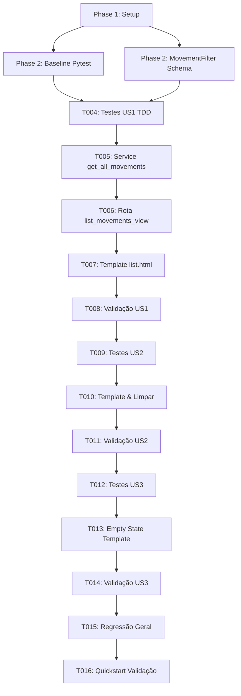

# Tasks: Adicionar Campo de Pesquisa no Fluxo Global de Movimentações

**Input**: Design documents from `specs/049-pesquisa-movimentacoes/`  
**Prerequisites**: [plan.md](plan.md) (✅), [spec.md](spec.md) (✅), [research.md](research.md) (✅ R1–R5), [data-model.md](data-model.md) (✅), [contracts/web-search-contract.md](contracts/web-search-contract.md) (✅), [quickstart.md](quickstart.md) (✅)

**Tests**: Testes automatizados obrigatórios cobrindo os cenários Testes A até J (spec §6, Constitution VIII). Arquivo dedicado `tests/test_movements_search.py`, com abordagem TDD antes da implementação de cada User Story, utilizando as fixtures existentes de `tests/conftest.py` (`client` autenticado e `db_session`). Nenhum teste existente será removido ou enfraquecido.

**Organization**: Tarefas agrupadas por User Story do spec — US1 Localizar movimentações por texto simples e parcial (P1 🎯 MVP), US2 Integração da pesquisa com os filtros existentes e limpeza (P2), US3 Feedback de estado vazio, responsividade e preservação de segurança (P3).

**Feature Branch**: `049-pesquisa-movimentacoes`

---

## Format: `[ID] [P?] [Story?] Description with file path`

- **[P]**: Pode rodar em paralelo (arquivos diferentes, sem dependência de tarefa incompleta)
- **[Story]**: Identificador da User Story da spec (`[US1]`, `[US2]`, `[US3]`) — omitido em Setup, Foundational e Polish
- Todas as descrições incluem caminhos exatos de arquivo e especificações inequívocas

---

## Phase 1: Setup (Contexto da Feature)

**Purpose**: Confirmar o estado do repositório e a presença dos artefatos de planejamento antes de qualquer modificação

- [x] T001 Verificar a integridade dos artefatos de design em `specs/049-pesquisa-movimentacoes/` (spec.md, plan.md, research.md, data-model.md, contracts/web-search-contract.md, quickstart.md) e confirmar que os arquivos-alvo da implementação estão limpos via `git status`

**Checkpoint**: Contexto confirmado — ambiente pronto para a fase fundacional.

---

## Phase 2: Foundational (Baseline e Extensão de Schemas — Bloqueia as Stories)

**Purpose**: Estabelecer a baseline de regressão da suíte existente e preparar o schema de dados compartilhado

**⚠️ CRITICAL**: Nenhuma tarefa de User Story pode começar antes da conclusão desta fase

- [x] T002 [P] Executar a baseline de testes existente de movimentações via `pytest tests/test_movements.py -v` e registrar que todos os 23 testes atuais estão verdes
- [x] T003 [P] Estender o schema Pydantic `MovementFilter` em `app/schemas/movement.py` adicionando o campo opcional `"search: Optional[str] = None # Novo campo: termo de pesquisa textual livre"` conforme especificado em `specs/049-pesquisa-movimentacoes/data-model.md`

**Checkpoint**: Baseline registrada e schema de filtro estendido — implementação das stories desbloqueada.

---

## Phase 3: User Story 1 — Localizar movimentações por texto simples e parcial (Priority: P1) 🎯 MVP

**Goal**: Permitir pesquisar movimentações diretamente por tombamento, nome do equipamento, colaborador, matrícula, local de origem/destino, tipo, operador ou termo, com correspondência parcial e case-insensitive

**Independent Test**: Submeter `GET /movements?search=PAT-99001` e verificar que apenas a movimentação daquele tombamento é retornada; submeter `GET /movements?search=Latitude` e retornar apenas as movimentações daquele equipamento

### Tests for User Story 1 (TDD — Devem falhar antes da implementação) ⚠️

- [x] T004 [P] [US1] Criar `tests/test_movements_search.py` com fixtures de movimentações e testes unitários/integração para US1: (a) busca por tombamento `PAT-99001` (Teste A); (b) busca parcial por nome do equipamento `Latitude` e `Dell` (Teste B); (c) busca por nome de colaborador `Rodrigo` e por matrícula `MAT-5001` na origem ou destino (Teste C); (d) busca por local de origem ou destino `TI Central` (Teste D); (e) busca por nome do operador e código do termo; (f) busca por tipo de movimentação via rótulo em português (ex.: `Transferência`) ou nome do enum; e confirmar que os testes falham antes da implementação

### Implementation for User Story 1

- [x] T005 [US1] Implementar a lógica de busca textual em `MovementService.get_all_movements` em `app/services/movement_service.py`: quando `filters.search` estiver presente, sanitizar com `strip()`, identificar eventuais correspondências em `MovementType` e montar cláusula `or_` com `ilike` para campos diretos (`operator_name`, `term_code`, `origin_location_name`, `destination_location_name`, `origin_custodian_name`, `destination_custodian_name`), subconsultas `.has()` para `asset` (`tag`, `name`), `origin_custodian` (`registration_code`, `name`), `destination_custodian` (`registration_code`, `name`), `origin_location` (`name`), `destination_location` (`name`) e `movement_type.in_(matching_types)`
- [x] T006 [US1] Atualizar a rota web `list_movements_view` em `app/web/routes.py`: adicionar o parâmetro `search: Optional[str] = None`, sanitizar valor com `strip()`, repassar ao `MovementFilter` e injetar `"search": clean_search or ""` no contexto de renderização do template, mantendo a permissão `movimentacao.visualizar`
- [x] T007 [US1] Atualizar o card de filtros em `app/web/templates/movements/list.html`: adicionar o campo de pesquisa com `input-group`, ícone `<i class="bi bi-search"></i>`, atributo `name="search"`, placeholder `"Pesquisar por tombamento, equipamento, colaborador, local, termo..."` e valor pré-preenchido `value="{{ search }}"`
- [x] T008 [US1] Executar `pytest tests/test_movements_search.py -k "test_search_by"` e validar que todos os testes da User Story 1 passam com 100% de sucesso

**Checkpoint**: User Story 1 funcional e testável isoladamente — MVP de pesquisa entregue.

---

## Phase 4: User Story 2 — Integração da pesquisa com os filtros existentes e limpeza (Priority: P2)

**Goal**: Garantir que a pesquisa funcione cumulativamente com o filtro de `movement_type`, que pesquisas vazias não filtrem nada e que a limpeza redefina a listagem

**Independent Test**: Submeter `GET /movements?search=Dell&movement_type=TRANSFERENCIA_LOCAL` e retornar exclusivamente transferências do equipamento Dell; submeter `GET /movements?search=` e retornar a listagem geral

### Tests for User Story 2

- [x] T009 [P] [US2] Estender `tests/test_movements_search.py` com cenários da US2: (a) busca combinada cumulativa entre termo textual e `movement_type` (Teste E); (b) submissão com termo vazio ou somente espaços em branco retornando a listagem geral sem filtro de texto (Teste G); (c) verificação de repopulação do campo de busca no HTML renderizado (`value="termo"`)

### Implementation for User Story 2

- [x] T010 [US2] Ajustar o formulário em `app/web/templates/movements/list.html` garantindo que os botões "Filtrar" e "Limpar" atuem harmonicamente em layout responsivo, preservando a ação de limpar através do link `<a href="/movements" class="btn btn-ghost">Limpar</a>`
- [x] T011 [US2] Executar `pytest tests/test_movements_search.py -k "test_search_combined or test_search_empty"` e confirmar que os testes da User Story 2 passam

**Checkpoint**: User Stories 1 e 2 integradas e testadas com sucesso.

---

## Phase 5: User Story 3 — Feedback de estado vazio, responsividade e preservação de segurança (Priority: P3)

**Goal**: Exibir mensagem amigável e clara quando a pesquisa não encontrar registros, respeitar limites de paginação e assegurar que o RBAC e as regras de movimentação permaneçam intocados

**Independent Test**: Submeter `GET /movements?search=TERMO_INEXISTENTE` e verificar HTTP 200 com mensagem "Nenhuma movimentação encontrada para a pesquisa informada."; testar acesso sem permissão recebendo 403

### Tests for User Story 3

- [x] T012 [P] [US3] Estender `tests/test_movements_search.py` com cenários da US3: (a) busca por termo inexistente retornando estado vazio com mensagem específica (Teste F); (b) consulta respeitando o limite padrão de 200 registros mais recentes (Teste H); (c) tentativa de acesso por usuário sem a permissão `movimentacao.visualizar` retornando 403 (Teste I); (d) verificação de que nenhuma alteração em registros de banco ocorre após a busca (operação read-only)

### Implementation for User Story 3

- [x] T013 [US3] Ajustar o bloco `.empty-state` em `app/web/templates/movements/list.html`: diferenciar visualmente quando houver pesquisa ativa (``), exibindo o título `"Nenhuma movimentação encontrada para a pesquisa informada."`, texto explicativo e botão de atalho para limpar a busca mantendo eventuais filtros de tipo selecionados
- [x] T014 [US3] Executar `pytest tests/test_movements_search.py` e validar que 100% dos testes das três user stories passam

**Checkpoint**: Todas as user stories implementadas e validadas com sucesso.

---

## Phase 6: Polish & Cross-Cutting Concerns

**Purpose**: Verificação de não-regressão completa, conformidade visual e encerramento do ciclo

- [x] T015 [P] Executar a suíte de regressão completa de movimentações e controle de acesso via `pytest tests/test_movements.py tests/test_rbac.py -v` garantindo zero regressões (Teste J)
- [x] T016 Executar o roteiro de testes e validação ponta a ponta documentado em `specs/049-pesquisa-movimentacoes/quickstart.md`

---

## Dependencies & Execution Order

### Parallel Opportunities

- **Fase 2**: `T002` (execução da baseline) e `T003` (edição do schema Pydantic) podem rodar em paralelo.
- **Testes por Story**: `T004`, `T009` e `T012` atuam sobre o mesmo arquivo de teste de forma incremental; podem ser escritos sequencialmente ou preparados em bloco.
- **Fase 6**: `T015` (regressão) pode rodar em paralelo com as validações de documentação.

---

## Implementation Strategy

### MVP First (User Story 1)
1. Completar Phase 1 e Phase 2 (Foundational).
2. Implementar User Story 1 (T004 a T008).
3. **STOP e VALIDAR**: Executar `pytest tests/test_movements_search.py -k "test_search_by"`. A busca básica já estará 100% funcional.

### Entrega Incremental
1. Adicionar User Story 2 (T009 a T011) para filtros cumulativos e limpeza.
2. Adicionar User Story 3 (T012 a T014) para estados vazios refinados e garantias de segurança.
3. Finalizar com Phase 6 para regressão global.
